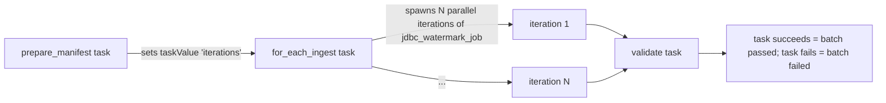

# feat: B2 Watermark Scale-Out Emission Pattern

## Overview

LHP's emission pattern for `jdbc_watermark_v2` flowgroups declaring `execution_mode: for_each`. Codegen replaces the current N-static-tasks emission with a three-task DAB topology: `prepare_manifest → for_each_ingest → validate`. The per-iteration worker is the existing `jdbc_watermark_job.py.j2` template plus a conditional `taskValues` header. New `b2_manifests` Delta table at ADR-004 placement (`metadata.<env>_orchestration.b2_manifests`). New `validate.py.j2` notebook gates the batch with a race-free retry-aware deterministic-join SQL. New `prepare_manifest.py.j2` notebook writes one manifest row per concrete action and emits one `iterations` taskValue. Tier 2 (`load_group` axis) is a hard prerequisite — B2's worker calls `WatermarkManager.get_latest_watermark(..., load_group=...)`.

Flowgroups without `execution_mode: for_each` keep the existing per-action static emission unchanged. Existing public `lhp_watermark` API is reused verbatim — zero new exports.

---

## Direct-JDBC Spike Findings (2026-04-25)

**Verdict**: B/B2 is the stronger direction for mass scale-out, but not the current static `jdbc_watermark_v2` implementation as-is.

### Key Results

- Static direct JDBC 68-table run passed first-run scale: 71/71 tasks successful, 49.58 min.
- Static direct JDBC second run **failed correctness**: duplicated max-watermark boundary rows because the deployed/current path uses `>=` watermark semantics.
- B-style direct JDBC `for_each` full run passed: run `729333305858621`, 68 tables, 759,240 source rows = 759,240 target rows, 0 validation failures, 45.31 min.
- B-style direct JDBC no-change second run passed: run `1060162614663980`, latest 68 watermark rows all had `row_count=0`, target total stayed 759,240, 0 validation failures.
- Old scale schemas `devtest_edp_bronze.jdbc_spike`, `devtest_edp_bronze.jdbc_spike_b`, and `devtest_edp_orchestration.jdbc_spike` were dropped successfully.

### Caveat — UC Table Quota

UC table quota blocked the B run variant that tried to create 68 registered target tables plus a scratch watermark table (estimated count: 539/500). The spike validated B with direct JDBC + `for_each` + strict watermarking using Delta path outputs and the existing `metadata.orchestration.watermarks` table under unique `source_system_id = b_jdbc_path_aw_20260425_174027`. That proves the orchestration/JDBC/watermark behavior, but the production B2 design needs an explicit UC table strategy.

### Audit Resources

- Job: `862576116537604`
- Workspace root: `/Workspace/Users/verbena1@gmail.com/.bundle/scooty_puff_junior/dev/files/b_jdbc_path_reval_20260425_174027`
- Target root: `/Volumes/main/_landing/landing/b_jdbc_path_reval_20260425_174027`
- Watermark rows: `metadata.orchestration.watermarks` where `source_system_id = 'b_jdbc_path_aw_20260425_174027'`

### Required B2 Design Constraints

These four constraints are design **requirements** derived from spike evidence. Each subsequent section of this plan that touches the relevant concern carries a `(see §Direct-JDBC Spike Findings, Constraint N)` reference.

1. **Strict `>` predicates** — NOT `>=`. The deployed `jdbc_watermark_v2` `>=` operator duplicates max-watermark boundary rows on every re-run. B2 must default to `>` (or require the operator to set it explicitly) and must not allow `>=` as an implicit default.
2. **Retry-safe / idempotent writes** — every worker write path must be safe to re-execute on DAB retry without duplicating data or corrupting watermark state.
3. **Explicit `for_each` concurrency controls** — concurrency must be declared and bounded in generated YAML; unbounded parallelism caused resource contention at scale.
4. **UC table strategy** — do NOT assume one-UC-table-per-extract; quota is tight (hit 539/500 in spike). Default to Delta path outputs OR shared registered tables. B2 codegen must not emit CREATE TABLE per-action.

---

## Problem Frame

Today LHP emits N static tasks per `jdbc_watermark_v2` flowgroup — one per action — into a single workflow YAML per pipeline. At fleet scale (50+ tables per flowgroup; 300+ across pipelines), this floods the DAB UI with one task per table and prevents per-iteration retry budget. Spike B (prototype) proved a `for_each` topology works at N=61, but raw Spike B swallowed exceptions, used `saveAsTable` as the idempotency primitive, and disconnected from the production L2 §5.3 contract.

B2 is the hardened variant. Same `for_each` topology, but:

1. Built on `lhp_watermark` substrate (production contract; not Spike B's standalone state).
2. Worker raises after `mark_failed` (matches `jdbc_watermark_job.py.j2:255-262` verbatim).
3. Idempotency = ADR-003 run-scoped landing (`<landing_root>/_lhp_runs/<run_id>/`), not `saveAsTable`. (see §Direct-JDBC Spike Findings, Constraint 2)
4. Validate gate joins manifest LEFT JOIN watermarks on `worker_run_id` (deterministic) — race-free under concurrent batches of the same flowgroup.

Five binding requirements (R1–R5) define the contract. Each maps to an implementation unit. (see origin: `docs/planning/b2-watermark-scale-out-design.md`)

---

## Requirements Trace

- R1. `prepare_manifest` writes one row per concrete action (post-template-expansion) into `metadata.<env>_orchestration.b2_manifests` with the schema: `batch_id`, `action_name`, `source_system_id`, `schema_name`, `table_name`, `load_group`, `worker_run_id`, `execution_status`, `created_at`, `updated_at`, PK `(batch_id, action_name)`. **HWM is NOT in manifest** — read live by worker.
- R1a. `prepare_manifest` is idempotent on retry via MERGE on `(batch_id, action_name)`. `batch_id = derive_run_id(dbutils)` once at task entry; DAB retries get a fresh `batch_id` (per `runtime.py:97`).
- R2. `prepare_manifest` emits exactly one taskValue with key `iterations`; payload is JSON array of objects with seven keys (`source_system_id`, `schema_name`, `table_name`, `action_name`, `load_group`, `batch_id`, `manifest_table`); ~250 bytes per entry; codegen rejects flowgroups with >300 post-expansion actions or zero actions.
- R3. Per-iteration worker is `jdbc_watermark_job.py.j2` with a single conditional header block: when `taskValues` are present (B2 path), unpack iteration kwargs; else fall through to existing static-render. Below header, L2 §5.3 body (`:255-262`) is unchanged. Worker writes its `worker_run_id` to `b2_manifests` via optimistic-concurrency UPDATE between `derive_run_id` and `insert_new`.
- R4. Worker's except block calls `mark_failed(type(e).__name__, str(e)[:4096])` then re-raises — exactly matching `jdbc_watermark_job.py.j2:255-262` today. `for_each_task.task.max_retries: 1` codegen default; operator override path documented.
- R5. `validate.py.j2` runs the manifest LEFT JOIN watermarks-on-`worker_run_id` query for the current `batch_id`; computes `final_status = coalesce(worker_status, manifest_status)`; passes when `completed_n == expected AND failed_n == 0 AND unfinished_n == 0`. Empty-batch is a no-op pass. Optional per-table parity check (`JDBC-rows-read == landed-parquet-rows`) gated by config flag.
- R6. `LHP-CFG-019` (separator collision), `LHP-CFG-026` (composite uniqueness), `LHP-CFG-028` (300-cap + empty-batch + concurrency bounds + same-pipeline-same-mode + shared `source_system_id`/`landing_path`/`wm_catalog`/`wm_schema`) — all flowgroup-level checks fire only when `execution_mode: for_each` is set; live in `ConfigValidator.validate_flowgroup` via `_validate_for_each_invariants` helper.
- R7. `FlowGroup.workflow` model accepts `execution_mode: "for_each"` and `concurrency: int` keys (concurrency bounds `1 ≤ concurrency ≤ 100`, default `min(action_count, 10)`). Free-form dict accepts these without strict Pydantic schema change today; optional typed wrapper for safety. (see §Direct-JDBC Spike Findings, Constraint 3)
- R8. `_generate_workflow_resources` in `orchestrator.py` enforces same-pipeline same-execution_mode at codegen time; mixed-mode flowgroups in one pipeline raise `LHPConfigError`.
- R9. `b2_manifests` table is created via auto-DDL inside `prepare_manifest.py.j2` notebook on first run (matches `_ensure_table_exists` pattern; avoids "works in dev, missing in prod").
- R10. Manifest 30-day DELETE retention ships with the initial deploy as a sibling task in the workflow (or sidecar notebook); not deferred to follow-up.
- R11. Operator runbook documents `for_each` adoption: `execution_mode` opt-in, `concurrency` tuning, error-code reference, `b2_manifests` retention cadence, `OPTIMIZE`/`VACUUM` policy on registry.
- R12. **B2 workers MUST use strict `>` watermark predicates, not `>=`.** Per Direct-JDBC Spike Findings Constraint 1, the static `jdbc_watermark_v2` path with `watermark_operator=">="` duplicated max-watermark boundary rows on second run. B2 inherits this defect by default — generator default lives at `src/lhp/generators/load/jdbc_watermark_job.py:243`. Two enforcement paths (either-or, U5 picks):
  - **(a) Codegen default change**: U5 changes the generator default to `">"` for `execution_mode: for_each`, leaving the legacy static path unchanged for back-compat.
  - **(b) Validator enforcement**: U2 emits a new fatal `LHP-CFG-029` when a flowgroup has `execution_mode: for_each` AND `watermark_operator != ">"`, forcing operator-explicit choice.
  R12 is hard — B2 cannot ship without either (a) or (b). Test scenario: rendered B2 notebook contains `WHERE <wm_col> > <hwm>` (not `>=`); second-run smoke shows zero duplicate rows. (see §Direct-JDBC Spike Findings, Constraint 1)

---

## Scope Boundaries

- **HIPAA hashing implementation.** Hook insertion point is documented in `jdbc_watermark_job.py.j2` template comment between JDBC read and landing write; no template code change ships in this milestone. The no-op default and column-masking implementation are deferred to a separate HIPAA milestone.
- **Bronze parity gate.** Downstream DLT pipeline owns parity vs landed parquet; B2 only validates `JDBC-rows-read == landed-parquet-rows` (optional, config-flagged).
- **B2 generalization to non-JDBC load types.** Start with `jdbc_watermark_v2`; generalize to `kafka`, `cloudfiles`, `delta` after JDBC production proof.
- **UC table strategy for target data.** B2 workers write to Delta path outputs (ADR-003) — not one-UC-registered-table-per-extract. UC quota at devtest is tight (spike hit 539/500); per-extract CREATE TABLE is out of scope and must not be introduced. (see §Direct-JDBC Spike Findings, Constraint 4)
- **Big-bang fleet migration.** Per-flowgroup adoption (`lhp seed-load-group` from Tier 2 plan) is the rollout path; B2 ships only the codegen, not the fleet flip.
- **Manifest table retention v2.** 30-day DELETE ships in U9; richer retention (batch-count-based, audit-window-aware) is deferred until operational data exists.
- **Append-only manifest path.** Known issue from origin doc: if write-hotspot mitigations on `b2_manifests` UPDATE prove insufficient, design migrates to append-only event-log + `ROW_NUMBER()` in validate. Out of scope for this plan; flag in Risks.
- **Per-iteration runtime distribution observability.** Histograms, p95 alerts — out of scope.
- **Tier 3 per-integration registry tables.**
- **`load_group NOT NULL WITH DEFAULT` flip.** One-way Delta protocol bump; deferred ≥30 days post-fleet adoption.
- **Spike A1 (SDP-native dynamic flows) revisit.** Deferred behind three triggers: ≥0.5 wall-clock min/table at N≥100 over 4 weeks, cost-tracking baseline, SDP foreign-catalog streaming GA — all three required.

### Deferred to Follow-Up Work

- Capture B2 migration evidence in follow-up ADR alongside Tier 2 (candidate ADR-005); author after first env ships.
- Recurring weekly `OPTIMIZE` + daily `VACUUM RETAIN 168 HOURS` policy on the watermarks registry — call it out in U11 runbook but operator schedules out-of-band.
- ManifestManager refactor (extract MERGE-with-retry helper from `WatermarkManager._merge_with_retry` into a sibling `lhp_watermark` module so `b2_manifests` writes share the same retry semantics) — preferred design, but doable in a follow-up if time-pressed.

---

## Context & Research

### Relevant Code and Patterns

- `src/lhp/core/orchestrator.py:1819-1873` (`_generate_workflow_resources`) — currently merges all `jdbc_watermark_v2` actions across flowgroups in a pipeline into one synthetic flowgroup, taking `workflow=ref_fg.workflow` from the first encountered. **B2 must enforce same-pipeline same-execution_mode here** (U7).
- `src/lhp/core/validator.py:61` (`validate_flowgroup`), `:118` (calls `_validate_readmode_compatibility`), `:179` (`_validate_readmode_compatibility` helper). **B2's `_validate_for_each_invariants` mirrors this exact shape** (U2).
- `src/lhp/core/services/flowgroup_processor.py:86-99` (template expansion Step 1), `:195` (validation Step 4). Validation runs after expansion; B2's 300-cap is correctly evaluated post-expansion.
- `src/lhp/core/validators/load_validator.py:182-247` — per-action JDBC v2 validation precedent; uses `LHP-VAL-04x` codes. **B2's flowgroup-level checks live in `ConfigValidator`, not `LoadActionValidator`** (origin doc says "in `LoadActionValidator`" — that's wrong by current architecture; fix in U2).
- `src/lhp/models/config.py:368-383` (`FlowGroup.workflow: Optional[Dict[str, Any]] = None`) — already free-form; accepts `execution_mode` and `concurrency` keys without strict schema change. Existing precedent: `flowgroup.workflow.get("extraction_mode") == "serial"` at `src/lhp/generators/bundle/workflow_resource.py:35-36`. **No Pydantic model change strictly required** (U1 makes this explicit; optional typed wrapper for safety).
- `src/lhp/generators/bundle/workflow_resource.py:32-78` — builds `extraction_tasks` list per action, assembles `template_context`. **B2 branches at top of `generate()` on `flowgroup.workflow.get("execution_mode") == "for_each"`** (U7).
- `src/lhp/templates/bundle/workflow_resource.yml.j2:1-32` — current N-static-tasks emission. **B2 wraps existing body in `` and adds `` for the three-task topology** (U7).
- `src/lhp/templates/load/jdbc_watermark_job.py.j2:42` (`_lhp_watermark_bootstrap_syspath()` call), `:67-71` (static-literal `source_system_id`/`schema_name`/`table_name`/`landing_path`), `:80` (`logged_action_name = {{ action_name|tojson }}` literal-injection precedent), `:142-163` (existing `` precedent for conditional branches), `:179-189` (`wm.insert_new` call site), `:255-262` (raise-on-failure block — referenced verbatim in B2 R4), `:283-297` (auxiliary-file write). **B2 adds a conditional `` header block above line 67** (U5).
- `src/lhp/generators/load/jdbc_watermark_job.py:233-250` — `template_context` dict; B2 adds `"execution_mode": flowgroup.workflow.get("execution_mode") if flowgroup.workflow else None` and reuses Tier 2's `"load_group"` (U8).
- `src/lhp/generators/load/jdbc_watermark_job.py:283-285` — auxiliary-file write pattern (`flowgroup._auxiliary_files["__lhp_extract_<action_name>.py"]`). **B2's `prepare_manifest.py` and `validate.py` follow this pattern**: filenames `__lhp_prepare_manifest_<flowgroup>.py` and `__lhp_validate_<flowgroup>.py` (U4, U6).
- `src/lhp_watermark/runtime.py:97` — `derive_run_id` returns `f"job-{job_run_id}-task-{task_run_id}-attempt-{attempt}"`. DAB retries get fresh `batch_id` per attempt (origin R1a).
- `src/lhp_watermark/sql_safety.py` — `SQLInputValidator` + `sql_literal`/`sql_identifier`/`sql_timestamp_literal`. **All B2 manifest SQL composition flows through these.**
- `src/lhp_watermark/watermark_manager.py:467` (`_merge_with_retry`) — Delta concurrent-commit retry helper. **B2 manifest UPDATEs need same retry semantics**; preferred path is to extract into a shared module in `lhp_watermark/`. If time-pressed, reimplement in `prepare_manifest.py.j2` (Risks).
- `src/lhp/cli/error_boundary.py:63-67` — `LHP-VAL-` and `LHP-CFG-` error formatting precedent.
- `src/lhp/utils/error_formatter.py:109-116` — `LHPConfigError` construction pattern; `ErrorCategory.CONFIG` → `LHP-CFG-NNN`. Working in-repo example: `LHP-CFG-018` raise at `src/lhp/generators/load/jdbc_watermark_job.py:160-183` (LandingPathOverlapsError).
- `tests/test_jdbc_watermark_v2_integration.py` (250+ lines) — class-based integration test with `_generate(self, project)` helper. **Pattern for `TestJDBCWatermarkV2ForEachIntegration`** (U10).
- `pyproject.toml:75` — `lhp.templates.bundle = ["*.j2"]` package data. **New `prepare_manifest.py.j2` and `validate.py.j2` go flat under `bundle/`** (avoid subdir requiring new package-data entry); or add `lhp.templates.bundle.tasks = ["*.j2"]` if subdir preferred.

### Institutional Learnings

- **ADR-002 §"Concrete deployment shape" lines 80–106** — `databricks bundle deploy` syncs entire repo (`src/lhp_watermark/` and `generated/${bundle.target}/`) under `${workspace.file_path}/`. B2 notebook templates deploy via the same path; rendered at `lhp generate` into `generated/<env>/<pipeline>_extract/`; DAB `notebook_path` references `${workspace.file_path}/...`.
- **`_lhp_watermark_bootstrap_syspath()`** (commit `a1c12852`) — prepends bundle files root to `sys.path` so `lhp_watermark` resolves at notebook execution. **`prepare_manifest.py.j2` and `validate.py.j2` MUST replicate this bootstrap** or imports will fail at runtime.
- **Spike B's three concrete gotchas** (`docs/ideas/spike-a1-vs-b-comparison.md`):
  1. `saveAsTable` idempotency fails on retry → B2 uses ADR-003 run-scoped landing instead. (see §Direct-JDBC Spike Findings, Constraint 2)
  2. prepare_manifest 403s for 73 sequential HWM lookups → Tier 2 makes batched `GROUP BY` per registry feasible.
  3. `abandoned` row provenance → B2's retry-aware validate (R5) handles without root-cause.
- **`derive_run_id` empirical verification** — per origin doc, `runtime.py:97` returns `job-{jobRunId}-task-{taskRunId}-attempt-{N}`. Confirmed empirically; B2 R1a + R3 + R4 all depend on this format being stable.
- **Manifest write hotspot** (origin Known Issues) — Delta optimistic-concurrency conflicts at concurrency=10 × N=300. Mitigations to evaluate during impl: partition by `batch_id`, deletion vectors, or append-only event-log fallback. Decide based on measured contention.
- **`max_retries` default** (origin Known Issues) — design defers to operator. Recommend codegen default `max_retries: 1`. Default 0 makes R4/R5 dead weight; default 3+ wastes budget on systematic source failures.
- **`b2_manifests` table-create owner** (origin Known Issues) — pinned to "auto-DDL inside `prepare_manifest` notebook on first run" matching `_ensure_table_exists` pattern.
- **`::` in observability surfaces** (origin Known Issues) — `load_group` flows into log lines; some log parsers interpret `:` as key/value separator. Cosmetic; flag in operator runbook.

### External References

- DAB `for_each_task` topology — accepts JSON-array taskValue ref `{{ tasks.<key>.values.<key> }}`; nests per-iteration `notebook_task`. Max concurrency 100, total iterations 5000 per `for_each_task` (Databricks docs). B2 enforces 300 cap (DAB task-value payload ≤48 KB) and concurrency 1–100.
- Delta MERGE INTO + optimistic concurrency — concurrent MERGE on the same key set under high parallelism causes commit conflicts; the existing `_merge_with_retry` helper handles this for `watermarks`. Same risk applies to `b2_manifests` UPDATE under concurrency=10 × N=300.

---

## Key Technical Decisions

- **Three-task DAB topology, not single ThreadPoolExecutor wrapper.** Collapsing prepare+validate into a wrapper loses DAB's per-iteration UI visibility — the explicit B2 win over A1. Cost: one extra ~10s task per job. Against ~30-min wall-clock at N=61, negligible.
- **Dynamic `prepare_manifest` notebook, not static codegen-time manifest.** A static manifest baked into YAML at codegen time cannot capture runtime context (`derive_run_id` reads DAB `job_run_id` only at execution time; secret-scope substitutions are runtime-resolved). Dynamic manifest matches existing template's runtime-resolution model.
- **Manifest carries iteration keys only; HWM read live by worker.** Earlier Spike B draft snapshotted HWM in manifest; that contradicted R3 (production contract). Live read matches `WatermarkManager.get_latest_watermark` semantics already in template.
- **Validate joins manifest → watermarks on `worker_run_id` (deterministic), not time-window.** Closes race concern between concurrent batches of the same flowgroup. Each batch isolated by `batch_id`; per-iteration `worker_run_id` is the join key.
- **Worker reuses `jdbc_watermark_job.py.j2` body verbatim.** Single conditional header block above line 67; L2 §5.3 body (`:255-262` raise-on-failure) unchanged. One diff point for review; legacy static-emission path falls through unchanged.

> **CONTRADICTS SPIKE CONSTRAINT 1 — REQUIRES UPDATE:** The existing `jdbc_watermark_job.py.j2` template defaults `watermark_operator` to `">="` (confirmed at `src/lhp/generators/load/jdbc_watermark_job.py:243`). The spike proved `>=` duplicates boundary rows on re-run. B2 must change the default operator to `">"` — or enforce that B2 workers explicitly set `">"` — before the template is reused for `for_each` workers. The current plan does not address this; it needs an explicit U5 requirement or a new sub-task.
- **`b2_manifests` table created via auto-DDL inside `prepare_manifest.py.j2`.** Matches `_ensure_table_exists` pattern. Alternative (Tier 2 migration creates the table) couples B2 to Tier 2 deploy timing; rejected.
- **Same-pipeline same-execution_mode required at codegen.** `_generate_workflow_resources` merges all jdbc_watermark_v2 actions across flowgroups by pipeline today (orchestrator.py:1853). B2 enforces that all flowgroups in one pipeline share the same `execution_mode` value. Operator splits across pipelines if mixed needed. (Resolved Q during planning.)
- **Flowgroup-level invariant checks live in `ConfigValidator.validate_flowgroup`, not `LoadActionValidator`.** Mirrors `_validate_readmode_compatibility` shape at validator.py:179. Origin doc said "in `LoadActionValidator`" — that's wrong by current architecture.
- **Error code numbering: LHP-CFG-019, LHP-CFG-026, LHP-CFG-028.** LHP-CFG-020/021/022/023/024/025/027 already taken (`docs/errors_reference.rst`). Sequential CFG matches `LHP-CFG-018` (LandingPathOverlapsError) precedent for generator-time cross-action invariants. (Resolved Q during planning.)
- **Manifest UPDATE optimistic-concurrency check is in-scope, not deferred.** Worker UPDATE `WHERE worker_run_id IS NULL OR worker_run_id = :previous_worker_run_id` (origin Known Issues). Cheapest mitigation; lands with the worker UPDATE itself.
- **`for_each_task.task.max_retries: 1` codegen default.** Operator override path: declare `workflow.max_retries: int` on flowgroup YAML; codegen threads to `for_each_task.task.max_retries`. (see §Direct-JDBC Spike Findings, Constraint 2)
- **`for_each_task` concurrency bounded by codegen default `min(action_count, 10)`.** Operator sets `workflow.concurrency`; codegen emits into YAML; R7 enforces `1 ≤ concurrency ≤ 100`. (see §Direct-JDBC Spike Findings, Constraint 3)
- **Manifest 30-day DELETE retention ships with initial deploy.** Not deferred. Sibling task in the workflow OR sidecar notebook scheduled separately. Decide during impl.
- **Empty-batch is no-op pass for validate**, but codegen rejects via LHP-CFG-028. A flowgroup expanding to zero actions is almost certainly authoring error, not intent.
- **No new public exports in `lhp_watermark.__init__.py`.** B2 consumes 10 existing names verbatim.

---

## Open Questions

### Resolved During Planning

- **Where do flowgroup-level invariant checks live?** `ConfigValidator.validate_flowgroup` via new `_validate_for_each_invariants` helper. Mirrors `_validate_readmode_compatibility` at validator.py:179.
- **How does the pipeline-scope workflow merge handle mixed-mode flowgroups?** Codegen rejects mixed flowgroups in one pipeline; operator splits. Lightest-touch resolution; preserves existing per-pipeline workflow YAML output.
- **Error-code numbering?** LHP-CFG-019 (separator), LHP-CFG-026 (uniqueness), LHP-CFG-028 (300-cap + empty-batch + concurrency bounds + same-mode + shared keys). Sequential CFG matches LHP-CFG-018 precedent.
- **`b2_manifests` DDL owner?** Auto-DDL inside `prepare_manifest.py.j2` on first run. Matches `_ensure_table_exists` pattern.
- **`max_retries` default?** Codegen default `1`; operator override via `workflow.max_retries` field.

### Deferred to Implementation

- **Manifest UPDATE write hotspot mitigation strategy.** At concurrency=10 × N=300, Delta optimistic-concurrency conflicts may matter. Options: partition by `batch_id`, deletion vectors, append-only event-log fallback. Decide during impl based on measured contention from devtest end-to-end smoke.
- **`_merge_with_retry` extraction vs reimplementation.** Preferred: extract `_merge_with_retry` from `WatermarkManager` into shared `lhp_watermark/_merge_helpers.py` module so `b2_manifests` writes share retry semantics. Alternative: reimplement in `prepare_manifest.py.j2`. Pick during U3 based on diff size.
- **`prepare_manifest.py.j2` template subdir structure.** Either flat under `lhp.templates.bundle/` (no `pyproject.toml` change) or `lhp.templates.bundle/tasks/` subdir (requires package-data entry). Pick during U4.
- **Same-pipeline same-mode error message wording.** When operator has mixed-mode flowgroups in a pipeline, error should suggest `lhp` command to split. Pick exact wording during U7.
- **Manifest 30-day DELETE: workflow task vs sidecar notebook.** Sibling task is more discoverable; sidecar notebook is more flexible (can be scheduled independently). Pick during U9.
- **Per-table parity check (VAL-04) implementation.** Optional flag on flowgroup YAML; emits `JDBC-rows-read == landed-parquet-rows` in validate. Define exact YAML shape during U6.

---

## Output Structure

```
src/lhp/templates/bundle/
├── workflow_resource.yml.j2          (modify: add for_each branch)
├── prepare_manifest.py.j2            (NEW: U4)
└── validate.py.j2                    (NEW: U6)

src/lhp/templates/load/
└── jdbc_watermark_job.py.j2          (modify: conditional header block U5)

src/lhp/generators/
├── bundle/workflow_resource.py       (modify: branch on execution_mode U7)
└── load/jdbc_watermark_job.py        (modify: thread execution_mode + auxiliary file emission U8)

src/lhp/core/
├── validator.py                      (modify: _validate_for_each_invariants U2)
└── orchestrator.py                   (modify: same-pipeline-same-mode guard U7)

src/lhp/models/
└── config.py                         (modify: FlowGroup.workflow type hint U1)

src/lhp_watermark/
└── _merge_helpers.py                 (NEW or reuse: U3 — pick during impl)

scripts/validation/
└── validate_b2_for_each_e2e.py       (NEW: end-to-end devtest smoke U12)

tests/
├── test_config_validator_for_each.py (NEW: U2 unit tests)
├── test_jdbc_watermark_v2_integration.py  (extend: U10 TestJDBCWatermarkV2ForEachIntegration class)
└── ... (parameterized lhp_watermark tests already covered in Tier 2 plan U7)

docs/
├── runbooks/b2-for-each-rollout.md   (NEW: U11)
└── errors_reference.rst              (modify: add CFG-019/026/028 U11)
```

---

## High-Level Technical Design

> *This illustrates the intended approach and is directional guidance for review, not implementation specification. The implementing agent should treat it as context, not code to reproduce.*

### Three-task DAB topology



### Worker conditional header

```
# in jdbc_watermark_job.py.j2

_lhp_watermark_bootstrap_syspath()    # unchanged


# B2 path: unpack iteration kwargs from taskValues
import json
iteration_json = dbutils.jobs.taskValues.get(taskKey="prepare_manifest", key="iterations")
# operator: figure out which iteration this is via dbutils.widgets or for_each_task input
# (DAB injects per-iteration input as widgets/env)
iteration = json.loads(dbutils.widgets.get("__lhp_iteration"))
source_system_id = iteration["source_system_id"]
schema_name      = iteration["schema_name"]
table_name       = iteration["table_name"]
load_group       = iteration["load_group"]
batch_id         = iteration["batch_id"]
manifest_table   = iteration["manifest_table"]

# legacy static path
source_system_id = {{ source_system_id|tojson }}
schema_name      = {{ schema_name|tojson }}
table_name       = {{ table_name|tojson }}
load_group       = {{ load_group|tojson }}    # from Tier 2 plan


# ... unchanged L2 §5.3 body below ...
```

### Validate gate SQL shape

```sql
WITH manifest AS (
  SELECT batch_id, action_name, worker_run_id, execution_status AS manifest_status
  FROM   metadata.<env>_orchestration.b2_manifests
  WHERE  batch_id = :batch_id
),
worker_states AS (
  SELECT m.action_name, w.status AS worker_status
  FROM   manifest m
  LEFT JOIN metadata.<env>_orchestration.watermarks w
    ON  w.run_id = m.worker_run_id
),
final AS (
  SELECT m.action_name,
         coalesce(w.worker_status, m.manifest_status) AS final_status
  FROM   manifest m
  LEFT JOIN worker_states w USING (action_name)
)
SELECT
  count(*)                                                         AS expected,
  count_if(final_status = 'completed')                             AS completed_n,
  count_if(final_status = 'failed')                                AS failed_n,
  count_if(final_status IN ('pending','running','landed_not_committed','abandoned')) AS unfinished_n
FROM final;
```

Pass conditions: `completed_n == expected AND failed_n == 0 AND unfinished_n == 0`.

### Worker manifest UPDATE optimistic concurrency

```sql
UPDATE b2_manifests
SET    worker_run_id    = :worker_run_id,
       execution_status = 'running',
       updated_at       = current_timestamp()
WHERE  batch_id   = :batch_id
  AND  action_name = :action_name
  AND  ( worker_run_id IS NULL OR worker_run_id = :previous_worker_run_id )
```

If the UPDATE matches zero rows under DAB-retry-timeout race, worker reads back current state and proceeds with the existing `worker_run_id` if it's the current attempt's, else aborts with a retry-friendly exception.

---

## Implementation Units

- [ ] U1. **Extend `FlowGroup.workflow` to accept `execution_mode` and `concurrency`**

**Goal:** YAML authors can declare `workflow.execution_mode: "for_each"` and `workflow.concurrency: int` on a `jdbc_watermark_v2` flowgroup; values reach codegen.

**Requirements:** R7

**Dependencies:** None (Tier 2 plan U2 must land first since downstream units call `WatermarkManager(load_group=...)`, but U1 itself doesn't need it).

**Files:**
- Modify: `src/lhp/models/config.py` (lines 368–383, `FlowGroup.workflow` type — keep `Optional[Dict[str, Any]]` or add typed wrapper)
- Test: `tests/test_models_config.py` (extend or new) — assert `FlowGroup` parses a workflow dict with `execution_mode` and `concurrency` keys.

**Approach:**
- Current type is `Optional[Dict[str, Any]]` — already accepts arbitrary keys. No strict schema change required.
- Optional safety improvement: define a `FlowGroupWorkflow` Pydantic model with `extraction_mode: Optional[str] = None`, `execution_mode: Optional[Literal["for_each"]] = None`, `concurrency: Optional[int] = None`, `max_retries: Optional[int] = None` and use `Optional[Union[Dict[str, Any], FlowGroupWorkflow]]` for back-compat.
- Decide during impl: typed wrapper now (cleaner) vs free-form (matches `extraction_mode` precedent). Either works; flag as a code-quality call.

**Patterns to follow:**
- Existing `extraction_mode` precedent at `workflow_resource.py:35-36` reads via `.get()` from the free-form dict.

**Test scenarios:**
- Happy path: parse a `FlowGroup` YAML with `workflow: { execution_mode: "for_each", concurrency: 10 }` → no error; values accessible via `flowgroup.workflow.get("execution_mode")` etc.
- Edge case: `workflow` absent → `flowgroup.workflow is None` → downstream code defaults gracefully.
- Edge case: `workflow.execution_mode` set to unsupported value (e.g. `"invalid"`) → not rejected at model layer; rejected at validator layer in U2.

**Verification:**
- Test scenarios pass.
- No existing FlowGroup test regresses.

---

- [ ] U2. **`_validate_for_each_invariants` in `ConfigValidator.validate_flowgroup`**

**Goal:** Flowgroups declaring `execution_mode: for_each` pass through three new error codes covering separator collision, composite uniqueness, and post-expansion structure (action count, concurrency bounds, shared keys).

**Requirements:** R6

**Dependencies:** U1

**Files:**
- Modify: `src/lhp/core/validator.py` — add `_validate_for_each_invariants(flowgroup)` helper; call from `validate_flowgroup` near line 118.
- Modify: `src/lhp/core/validator.py` — add project-level uniqueness check across all flowgroups in the project (LHP-CFG-026); requires extending `ConfigValidator` to accept a project-scope context (mirror existing project-scope check shape if any, else add as a class-level state collected during `validate_project`).
- Modify: `src/lhp/utils/error_formatter.py` — register new error codes if a registry pattern exists; otherwise codes are claimed by string match in raise sites.
- Modify: `docs/errors_reference.rst` — append `LHP-CFG-019`, `LHP-CFG-026`, `LHP-CFG-028` entries with cause + fix (kept here so the docs and validator land in the same commit; final docs polishing in U11).
- Create: `tests/test_config_validator_for_each.py`

**Approach:**
- `_validate_for_each_invariants(flowgroup)` runs only when `flowgroup.workflow and flowgroup.workflow.get("execution_mode") == "for_each"`.
- **LHP-CFG-019 (separator collision):** if `"::" in flowgroup.pipeline` or `"::" in flowgroup.flowgroup`, raise `LHPConfigError(code_number="019", title="Separator collision: '::' reserved for load_group composite", suggestions=["rename pipeline or flowgroup to remove '::'"])`.
- **LHP-CFG-026 (composite uniqueness):** at project scope (in `validate_project` or via a class-level set populated during `validate_flowgroup`), build composites for every `for_each` flowgroup; if any composite repeats, raise `LHPConfigError(code_number="026", title="Composite load_group is not unique within project", suggestions=["rename pipeline or flowgroup so composite '<pipeline>::<flowgroup>' is unique"])`.
- **LHP-CFG-028 (post-expansion structure):** evaluated after `FlowgroupProcessor.expand_templates` runs (`flowgroup_processor.py:86-99`). Checks:
  - Action count > 0 and ≤ 300 (else raise; "Split by source schema prefix or table subset into multiple flowgroups; batch-scoped manifest isolates them.")
  - All actions share `source.source_system_id`, `source.landing_path` root prefix, and watermark `wm_catalog`/`wm_schema`. If any disagree, raise.
  - `concurrency` bounds: `1 ≤ concurrency ≤ 100`. If absent, default `min(action_count, 10)`. If outside bounds, raise.
  - **Same-pipeline same-execution_mode:** project-scope check; if a pipeline contains both `for_each` and non-`for_each` flowgroups, raise (origin doc: U7 enforces this in orchestrator merge; U2 catches it earlier at validator stage so the error is friendlier).
- All raises flow through `cli_error_boundary` → formatted error output (existing pattern).

**Patterns to follow:**
- `_validate_readmode_compatibility` at `validator.py:179` — same shape (cross-action / flowgroup-level helper called from `validate_flowgroup`).
- `LHP-CFG-018` raise at `src/lhp/generators/load/jdbc_watermark_job.py:160-183` — `LHPConfigError` construction with title, details, context, suggestions.

**Test scenarios:**
- Happy path (LHP-CFG-019): `pipeline='bronze', flowgroup='customers_daily', execution_mode=for_each` → no error.
- Error path (LHP-CFG-019): `pipeline='bronze::core', flowgroup='customers_daily', execution_mode=for_each` → raise; error mentions `pipeline` field.
- Error path (LHP-CFG-019): `pipeline='bronze', flowgroup='customers::daily', execution_mode=for_each` → raise; error mentions `flowgroup` field.
- Edge case (LHP-CFG-019 inactive): `pipeline='bronze::core'` but `execution_mode` unset → no error (legacy flowgroups using `::` for unrelated reasons are not blocked).
- Error path (LHP-CFG-026): two flowgroups in project both produce composite `bronze::customers_daily` (e.g. one renamed mid-development) → raise; error lists both file paths.
- Edge case (LHP-CFG-026 inactive): two flowgroups produce different composites → no error.
- Error path (LHP-CFG-028 action count): flowgroup expands to 0 actions → raise.
- Error path (LHP-CFG-028 action count): flowgroup expands to 301 actions → raise; suggestion text includes "Split by source schema prefix".
- Edge case (LHP-CFG-028 action count): flowgroup expands to 1 action → no error.
- Edge case (LHP-CFG-028 action count): flowgroup expands to 300 actions → no error (cap is inclusive).
- Error path (LHP-CFG-028 shared keys): flowgroup with two actions disagreeing on `source_system_id` → raise.
- Error path (LHP-CFG-028 shared keys): flowgroup with two actions disagreeing on `landing_path` root prefix → raise.
- Error path (LHP-CFG-028 shared keys): flowgroup with two actions disagreeing on `wm_catalog` or `wm_schema` → raise.
- Error path (LHP-CFG-028 concurrency): `workflow.concurrency: 0` → raise.
- Error path (LHP-CFG-028 concurrency): `workflow.concurrency: 101` → raise.
- Edge case (LHP-CFG-028 concurrency default): `workflow.concurrency` unset, action_count=5 → no error; codegen default = 5.
- Error path (LHP-CFG-028 same-mode): pipeline `bronze` contains flowgroup A (`execution_mode: for_each`) and flowgroup B (no execution_mode) → raise; error names the conflicting pipeline.
- Integration: full project validation runs all checks at project scope; uniqueness collisions across files surface with both file paths.
- Covers AE: each error code corresponds to an Acceptance Example from origin doc R6/R7/R8 — link by code in the test docstring.

**Verification:**
- All test scenarios pass.
- `lhp validate` against a fixture project with each error case produces formatted error output via `cli_error_boundary`.
- `docs/errors_reference.rst` entries are linked from each error message.

---

- [ ] U3. **`b2_manifests` schema + auto-DDL + (optional) `_merge_with_retry` extraction**

**Goal:** `b2_manifests` Delta table is created on first run via auto-DDL inside `prepare_manifest.py.j2`; MERGE-with-retry semantics for manifest writes match `WatermarkManager._merge_with_retry`.

**Requirements:** R1, R9

**Dependencies:** None (Tier 2 plan U1 affects the watermarks DDL but not the manifest DDL).

**Files:**
- Create: `src/lhp_watermark/_merge_helpers.py` (preferred) — extract `_merge_with_retry` from `watermark_manager.py:467` into a shared module. Or skip if reimplementing inline in U4.
- Modify: `src/lhp_watermark/watermark_manager.py` (only if extracting) — replace inline `_merge_with_retry` with import from `_merge_helpers`.
- Test: `tests/lhp_watermark/test_merge_helpers.py` (only if extracting) — cover MERGE-with-retry semantics independent of `WatermarkManager`.

**Approach:**
- **Decision: extract or reimplement?** Prefer extraction. The retry semantics (Delta optimistic-concurrency back-off with bounded jitter) are nontrivial; sharing the helper is cleaner than duplicating in `prepare_manifest.py.j2`. If extraction diff turns out >100 lines (unlikely), reimplement inline.
- Extracted module exports `merge_with_retry(spark, target_table, source_view, on_clause, when_matched_set, when_not_matched_insert, max_retries=3) -> int`.
- `WatermarkManager._merge_with_retry` becomes a thin wrapper around the helper.
- Manifest DDL lives inside U4's `prepare_manifest.py.j2` notebook (auto-DDL on first run); this unit only ships the SQL helper.

**Execution note:** Test-first. Write `test_merge_helpers.py` with mock-Spark MERGE retry scenarios before extracting.

**Patterns to follow:**
- `WatermarkManager._merge_with_retry` at `watermark_manager.py:467` — full retry loop shape.
- Existing `_RecordingSpark` mock pattern for SQL composition tests.

**Test scenarios:**
- Happy path: MERGE succeeds on first attempt → returns 1, zero retries.
- Edge case: MERGE fails with `DELTA_CONCURRENT_MODIFICATION` once → retries with jitter → succeeds → returns 1, one retry.
- Error path: MERGE fails 4 times in a row → exhausts retry budget → raises `WatermarkConcurrencyError` (LHP-WM-004).
- Edge case: non-concurrency error (e.g. malformed SQL) → does not retry; raises immediately.

**Verification:**
- Test scenarios pass.
- `WatermarkManager` existing tests still pass (extraction is invisible to callers).
- If reimplementation chosen instead: U4 inline retry passes scenarios above against `prepare_manifest.py.j2` rendered notebook.

---

- [ ] U4. **`prepare_manifest.py.j2` notebook template**

**Goal:** First task of B2 workflow auto-creates `b2_manifests` (if absent), MERGEs one row per concrete action, and emits one `iterations` taskValue.

**Requirements:** R1, R1a, R2, R9

**Dependencies:** U3 (or fallback inline retry); Tier 2 plan U2 not strictly required (this notebook does not call `WatermarkManager` directly).

**Files:**
- Create: `src/lhp/templates/bundle/prepare_manifest.py.j2` (or `lhp/templates/bundle/tasks/prepare_manifest.py.j2`; pick during impl based on `pyproject.toml` package-data structure)
- Modify: `pyproject.toml` (only if subdir chosen) — add `lhp.templates.bundle.tasks = ["*.j2"]`.
- Test: `tests/test_prepare_manifest_template.py` (new) — render template against a fixture flowgroup; exec rendered Python against `_RecordingSpark`; assert SQL emitted matches the schema and MERGE shape.

**Approach:**
- Notebook header: standard Databricks notebook conventions (`# Databricks notebook source`), `# COMMAND ----------` cell separators.
- Cell 1: `_lhp_watermark_bootstrap_syspath()` (replicate from `jdbc_watermark_job.py.j2`).
- Cell 2: `from lhp_watermark.runtime import derive_run_id`; from `lhp_watermark.sql_safety import SQLInputValidator, sql_literal, sql_identifier, sql_timestamp_literal`; from `lhp_watermark._merge_helpers import merge_with_retry` (or inline).
- Cell 3: read substitution config (`wm_catalog`, `wm_schema`, manifest table = `metadata.<env>_orchestration.b2_manifests`).
- Cell 4: auto-DDL — `SHOW TABLES IN metadata.<env>_orchestration` → if `b2_manifests` absent, emit:
  ```sql
  CREATE TABLE IF NOT EXISTS metadata.<env>_orchestration.b2_manifests (
      batch_id         STRING NOT NULL,
      action_name      STRING NOT NULL,
      source_system_id STRING NOT NULL,
      schema_name      STRING NOT NULL,
      table_name       STRING NOT NULL,
      load_group       STRING NOT NULL,
      worker_run_id    STRING,
      execution_status STRING NOT NULL,
      created_at       TIMESTAMP NOT NULL,
      updated_at       TIMESTAMP NOT NULL,
      CONSTRAINT pk_b2_manifests PRIMARY KEY (batch_id, action_name)
  )
  USING DELTA
  CLUSTER BY (batch_id)
  TBLPROPERTIES (
      'delta.enableChangeDataFeed' = 'true',
      'delta.autoOptimize.optimizeWrite' = 'true',
      'delta.autoOptimize.autoCompact' = 'true'
  )
  ```
- Cell 5: `batch_id = derive_run_id(dbutils)` (once at task entry).
- Cell 6: build manifest source rows from codegen-injected `actions` list (Jinja loop over post-expansion actions). Each row carries `(batch_id, action_name, source_system_id, schema_name, table_name, load_group)`.
- Cell 7: MERGE via `merge_with_retry`:
  ```sql
  MERGE INTO metadata.<env>_orchestration.b2_manifests t
  USING ( <SELECT of source rows from VALUES> ) s
  ON t.batch_id = s.batch_id AND t.action_name = s.action_name
  WHEN MATCHED THEN UPDATE SET t.updated_at = current_timestamp()
  WHEN NOT MATCHED THEN INSERT (batch_id, action_name, source_system_id, schema_name, table_name, load_group, worker_run_id, execution_status, created_at, updated_at)
                       VALUES (s.batch_id, s.action_name, s.source_system_id, s.schema_name, s.table_name, s.load_group, NULL, 'pending', current_timestamp(), current_timestamp())
  ```
- Cell 8: build `iterations` JSON array. Each entry: `{source_system_id, schema_name, table_name, action_name, load_group, batch_id, manifest_table}`.
- Cell 9: emit taskValue: `dbutils.jobs.taskValues.set(key="iterations", value=json.dumps(iterations))`.
- Cell 10: log entry-count + total payload bytes (operator visibility into 48 KB ceiling).

**Patterns to follow:**
- `src/lhp/templates/load/jdbc_watermark_job.py.j2` — full Databricks-notebook template shape, including `_lhp_watermark_bootstrap_syspath()` and Jinja loop precedents (line 80 `tojson`).
- `WatermarkManager._ensure_table_exists` at `watermark_manager.py:155` — DDL composition shape.
- `lhp_watermark.sql_safety` — every interpolated value flows through `SQLInputValidator` + `sql_literal`/`sql_identifier`/`sql_timestamp_literal`.

**Test scenarios:**
- Happy path: render template against a fixture flowgroup with 3 actions → exec rendered Python against `_RecordingSpark` → assert `b2_manifests` DDL emitted exactly once (when SHOW TABLES returns empty), MERGE source contains exactly 3 rows, taskValue payload is JSON array of 3 entries with seven keys each.
- Edge case (idempotency): re-run notebook against `_RecordingSpark` simulating pre-existing `b2_manifests` table → DDL skipped; MERGE still runs; same 3 rows.
- Edge case (DAB retry): re-run notebook with same `dbutils` mock returning a new `derive_run_id` (different `attempt` token) → fresh `batch_id`; MERGE inserts 3 new rows (origin R1a "DAB retry produces fresh batch_id; orphaned rows from prior attempt are slow-leak").
- Error path: `derive_run_id` returns malformed value (no `attempt` segment) → `SQLInputValidator.string` rejects → `WatermarkValidationError` (LHP-WM-003).
- Edge case (300 entries): fixture flowgroup expands to 300 actions → taskValue payload size logged ≤ 48 KB.
- Error path (>300 entries): codegen rejects via LHP-CFG-028 in U2; this template never receives a >300 fixture. Negative test in U2.
- Covers AE: assert taskValue key is exactly `"iterations"` (origin R2 explicit naming).

**Verification:**
- Test scenarios pass.
- Devtest end-to-end smoke (U12) confirms DAB ingests the taskValue and `for_each_task` spawns the right iteration count.

---

- [ ] U5. **Conditional `taskValues` header in `jdbc_watermark_job.py.j2` + manifest UPDATE**

**Goal:** Per-iteration worker generated from `jdbc_watermark_job.py.j2` unpacks `taskValues` in conditional header (B2 path) or falls through to existing static literals (legacy path). Worker writes its `worker_run_id` to `b2_manifests` between `derive_run_id` and `insert_new` via optimistic-concurrency UPDATE. **U5 also enforces R12 — strict `>` watermark predicate semantics for B2 workers.** Pick path (a) [codegen default change] or (b) [U2 validator gate] from R12; goal completion gates on rendered B2 notebook emitting `WHERE <wm_col> > <hwm>` (NOT `>=`).

**Requirements:** R3, R4, R12

**Dependencies:** U4 (manifest table exists); Tier 2 plan U2 (worker calls `get_latest_watermark(load_group=...)`).

**Files:**
- Modify: `src/lhp/templates/load/jdbc_watermark_job.py.j2` — add `` conditional header block above line 67 (static literals).
- Modify: `src/lhp/templates/load/jdbc_watermark_job.py.j2` — between `derive_run_id` and `insert_new`, add manifest UPDATE block (only when `execution_mode == "for_each"`).
- Modify: `src/lhp/templates/load/jdbc_watermark_job.py.j2` — add comment marker indicating HIPAA hook insertion point inside try block before `mark_landed` (origin R3 explicit; no code change ships).
- Test: `tests/test_jdbc_watermark_v2_integration.py` (extend) — assert generated extraction notebook contains taskValues unpack header + manifest UPDATE when flowgroup has `execution_mode: for_each`.

**Approach:**
- Conditional header above static literals: see High-Level Technical Design "Worker conditional header".
- Manifest UPDATE shape: see High-Level Technical Design "Worker manifest UPDATE optimistic concurrency".
- The UPDATE happens AFTER `derive_run_id` (so `worker_run_id` exists) and BEFORE `insert_new` (so manifest reflects current attempt before watermark row exists).
- On UPDATE matches-zero (DAB-retry-timeout race): worker reads back current `worker_run_id` from manifest; if it equals current attempt's `derive_run_id`, proceed (we're the retry); else raise a retry-friendly exception.
- Below header + UPDATE, existing L2 §5.3 body (`:67-310`) is unchanged. Specifically `:255-262` raise-on-failure block is verbatim.
- HIPAA hook comment marker: `# HIPAA hook insertion point: between JDBC read (line ~XXX) and landing write (line ~XXX). Implementation deferred to HIPAA milestone.`

**Patterns to follow:**
- Existing `` precedent at `jdbc_watermark_job.py.j2:142-163` for conditional Jinja branches.
- `tojson` literal-injection precedent at line 80 (`logged_action_name`).
- `_lhp_watermark_bootstrap_syspath()` import at line 42 — unchanged.

**Test scenarios:**
- Happy path (legacy): `execution_mode` unset → rendered notebook has no taskValues unpack; static literals at lines 67–71; no manifest UPDATE block. Diff vs current template shows zero added executable lines (only Jinja conditional comments).
- Happy path (B2): `execution_mode: for_each` → rendered notebook contains `iteration = json.loads(dbutils.widgets.get("__lhp_iteration"))` block; static literals replaced with iteration kwargs; manifest UPDATE block emitted between `derive_run_id` and `insert_new`.
- Edge case (idempotency on retry): rendered notebook contains optimistic-concurrency check (`WHERE worker_run_id IS NULL OR worker_run_id = :previous_worker_run_id`).
- Edge case (cold start): rendered notebook contains the existing `if get_latest_watermark returns None: extraction_type='full'` path — unchanged from current behavior.
- Edge case (raise after mark_failed): rendered notebook lines `:255-262` are byte-identical to current template (R4 explicit invariant).
- Error path: B2 path with `iteration` JSON missing required key → notebook raises `KeyError`; outer try/except calls `mark_failed` then re-raises (already covered by L2 §5.3).
- Documentation: rendered notebook contains HIPAA hook comment marker; no executable HIPAA code.
- Covers AE: assert worker calls `get_latest_watermark(..., load_group=load_group)` (Tier 2 plan U3 verified this; B2 verifies the kwarg is plumbed through the iteration unpack).

**Verification:**
- Test scenarios pass.
- Diff of rendered notebook between B2 and legacy modes shows only the conditional header block + manifest UPDATE block as additions.

---

- [ ] U6. **`validate.py.j2` notebook template**

**Goal:** Final task of B2 workflow runs the manifest LEFT JOIN watermarks-on-`worker_run_id` query for the current `batch_id`, computes `final_status = coalesce(worker_status, manifest_status)`, and passes only when all expected actions completed and zero unfinished/failed.

**Requirements:** R5

**Dependencies:** U3, U4 (manifest table + helpers); Tier 2 plan U2 (watermarks table has `load_group`, but validate joins on `worker_run_id` not `load_group`).

**Files:**
- Create: `src/lhp/templates/bundle/validate.py.j2`
- Test: `tests/test_validate_template.py` — render template; exec against `_RecordingSpark`; assert SQL composition + pass/fail logic.

**Approach:**
- Notebook header + `_lhp_watermark_bootstrap_syspath()` (same prelude as `prepare_manifest.py.j2`).
- Read `batch_id` from upstream taskValue or DAB widget.
- Run the validate SQL (see High-Level Technical Design "Validate gate SQL shape").
- Compute pass conditions: `completed_n == expected AND failed_n == 0 AND unfinished_n == 0`.
- If pass: log + exit 0 (`dbutils.notebook.exit(json.dumps({'status': 'pass', 'expected': N, 'completed_n': N, ...}))`).
- If fail: log + raise (so DAB validate task reports failure to the workflow).
- **Empty-batch handling:** `expected == 0 AND failed_n == 0 AND unfinished_n == 0` → trivial pass with `status: 'noop_pass'`.
- **Optional per-table parity check (VAL-04):** when `flowgroup.workflow.parity_check: true`, run a second SQL that joins `b2_manifests` to landed-parquet metadata (`spark.read.parquet(landing_path).groupBy('action_name').count()`) and asserts `JDBC-rows-read == landed-parquet-rows`. Define exact YAML shape during impl.

**Patterns to follow:**
- `prepare_manifest.py.j2` (U4) — full notebook structure, prelude, SQL composition through safety helpers.
- `WatermarkManager.get_latest_watermark` SQL composition pattern at `watermark_manager.py:207-297`.

**Test scenarios:**
- Happy path: 3-action batch all `completed` → `expected=3, completed_n=3, failed_n=0, unfinished_n=0` → pass exit.
- Error path: 1 of 3 actions `failed` → `failed_n=1` → raise; error message includes failed action name.
- Error path: 1 of 3 actions still `running` → `unfinished_n=1` → raise.
- Edge case (manifest-only): action has manifest row `pending` but no watermark row (worker never started) → `worker_status IS NULL`, `manifest_status='pending'`, `final_status='pending'` → counted as unfinished → raise.
- Edge case (registry-only mid-flight): worker wrote `running` to watermarks but manifest UPDATE hasn't propagated yet (race) → `worker_status='running'` → counted as unfinished → raise. (This case is rare; the optimistic-concurrency UPDATE in U5 closes most windows.)
- Edge case (empty batch): `expected=0` → pass with `status: 'noop_pass'`.
- Edge case (concurrent batches): two batches `B1` and `B2` of same flowgroup running in parallel → validate for `batch_id=B1` filters by `batch_id=B1` only; B2's rows are not visible to B1's validate.
- Optional path (parity flag): `parity_check: true` and JDBC-rows-read equals landed-parquet-rows → pass.
- Optional path (parity flag fail): JDBC-rows-read differs from landed-parquet-rows for one action → raise; error message includes action name + both counts.
- Covers AE: pass conditions match origin R5 verbatim (`completed_n == expected AND failed_n == 0 AND unfinished_n == 0`).

**Verification:**
- Test scenarios pass.
- Devtest end-to-end smoke (U12) confirms validate fails the DAB job when any iteration fails.

---

- [ ] U7. **Bundle generator branch + `workflow_resource.yml.j2` `for_each_task` rendering + orchestrator merge guard**

**Goal:** `WorkflowResourceGenerator.generate()` branches on `flowgroup.workflow.execution_mode == "for_each"` and emits the three-task DAB topology. Legacy non-for_each flowgroups continue emitting current per-action static topology byte-identically. `_generate_workflow_resources` in orchestrator rejects mixed-mode flowgroups in one pipeline before reaching the generator.

**Requirements:** R8, R10 (for max_retries default)

**Dependencies:** U2 (validator catches mixed-mode earlier with friendlier error; orchestrator guard is the safety net), U4, U5, U6

**Files:**
- Modify: `src/lhp/generators/bundle/workflow_resource.py:32-78` — branch on `flowgroup.workflow.get("execution_mode")`; for `for_each`, build different `template_context` (with `prepare_manifest_path`, `validate_path`, `iterations_taskvalue_ref`, `concurrency`, `max_retries`).
- Modify: `src/lhp/templates/bundle/workflow_resource.yml.j2:1-32` — wrap existing N-task body in ``; add `` branch rendering the three-task topology with `for_each_task`.
- Modify: `src/lhp/core/orchestrator.py:1819-1873` — before building `merged_fg`, scan all flowgroups in the pipeline; if `execution_mode` values disagree, raise `LHPConfigError` (uses LHP-CFG-028 from U2's same-mode check, friendlier copy here).
- Test: `tests/test_workflow_resource_for_each.py` (new) + extend `tests/test_jdbc_watermark_v2_integration.py`.

**Approach:**
- Generator branch: when `execution_mode == "for_each"`, `template_context` includes:
  - `prepare_manifest_path`: `${workspace.file_path}/generated/${bundle.target}/<pipeline>_extract/__lhp_prepare_manifest_<flowgroup>` (no `.py` suffix per ADR-002 line 118)
  - `validate_path`: same pattern with `__lhp_validate_<flowgroup>`
  - `worker_path`: existing extraction notebook path
  - `iterations_taskvalue_ref`: `{{ tasks.prepare_manifest.values.iterations }}` (rendered into YAML — escape Jinja braces in `.j2` via ``)
  - `concurrency`: `flowgroup.workflow.get("concurrency") or min(action_count, 10)`
  - `max_retries`: `flowgroup.workflow.get("max_retries") or 1` (codegen default)
- YAML template branch:
  ```yaml
  
  resources:
    jobs:
      {{ pipeline_name }}_workflow:
        name: {{ pipeline_name }}
        tasks:
          - task_key: prepare_manifest
            notebook_task:
              notebook_path: {{ prepare_manifest_path }}
          - task_key: for_each_ingest
            depends_on:
              - task_key: prepare_manifest
            for_each_task:
              inputs: {{ tasks.prepare_manifest.values.iterations }}
              concurrency: {{ concurrency }}
              task:
                notebook_task:
                  notebook_path: {{ worker_path }}
                max_retries: {{ max_retries }}
          - task_key: validate
            depends_on:
              - task_key: for_each_ingest
            notebook_task:
              notebook_path: {{ validate_path }}
  
  {# existing N-static-tasks emission unchanged #}
  ...
  
  ```
- Orchestrator guard: in `_generate_workflow_resources`, after collecting `pipeline_v2_actions`, also collect `pipeline_workflow_modes: dict[str, set[str]]`. For each pipeline, if the set has both `'for_each'` and non-`'for_each'` (or differs from a single value), raise.

**Patterns to follow:**
- Existing `flowgroup.workflow.get("extraction_mode") == "serial"` precedent at `workflow_resource.py:35-36`.
- Existing per-pipeline merge at `orchestrator.py:1853` — inject the same-mode check before line 1856.
- ADR-002 `notebook_path` convention (no `.py` suffix).

**Test scenarios:**
- Happy path (legacy): flowgroup with no `execution_mode` → generated YAML byte-identical to current output.
- Happy path (B2): flowgroup with `execution_mode: for_each, concurrency: 5` → generated YAML has three tasks (`prepare_manifest`, `for_each_ingest`, `validate`); `for_each_task.inputs` references `iterations` taskValue; `concurrency: 5`; `task.max_retries: 1`.
- Edge case (max_retries override): flowgroup with `execution_mode: for_each, max_retries: 3` → generated YAML has `task.max_retries: 3`.
- Edge case (concurrency default): flowgroup with `execution_mode: for_each` and 5 actions, no concurrency → generated YAML has `concurrency: 5`.
- Edge case (concurrency cap): flowgroup with `execution_mode: for_each` and 50 actions, no concurrency → generated YAML has `concurrency: 10`.
- Error path (mixed-mode): pipeline with flowgroup A `execution_mode: for_each` and flowgroup B unset → orchestrator raises; error names both flowgroups.
- Error path (escape): rendered YAML preserves `{{ tasks.prepare_manifest.values.iterations }}` literal (via ``).
- Integration (full pipeline): orchestrator generates extraction notebooks + `prepare_manifest.py` + `validate.py` + workflow YAML; all four artifacts land at expected paths under `generated/<env>/<pipeline>_extract/`.
- Covers AE: U7 enforces same-pipeline same-mode at codegen — confirmed by integration test fixture.

**Verification:**
- Test scenarios pass.
- Generated YAML for a B2 fixture validates against DAB schema (use `databricks bundle validate` if integrated; otherwise a JSON-schema check).
- Diff of legacy YAML before/after this unit shows zero changes.

---

- [ ] U8. **Generator threads `execution_mode` + auxiliary file emission**

**Goal:** `JDBCWatermarkJobGenerator` populates `execution_mode` in template context; emits `__lhp_prepare_manifest_<flowgroup>.py` and `__lhp_validate_<flowgroup>.py` as auxiliary files per existing pattern.

**Requirements:** R3, R5 (auxiliary file emission infrastructure for U4 + U6 templates to actually land on disk)

**Dependencies:** U1, U4, U5, U6

**Files:**
- Modify: `src/lhp/generators/load/jdbc_watermark_job.py:233-250` — add `"execution_mode": flowgroup.workflow.get("execution_mode") if flowgroup.workflow else None` to `template_context`. Reuses Tier 2 plan U3's `"load_group"` value.
- Modify: `src/lhp/generators/load/jdbc_watermark_job.py:283-285` (auxiliary file write) — when `execution_mode == "for_each"`, also render `prepare_manifest.py.j2` and `validate.py.j2` and write to `flowgroup._auxiliary_files["__lhp_prepare_manifest_<flowgroup>.py"]` and `__lhp_validate_<flowgroup>.py`.
- Test: `tests/test_jdbc_watermark_v2_integration.py` (extend) — assert auxiliary files exist on disk after generation.

**Approach:**
- The generator already writes the extraction notebook as an auxiliary file (`__lhp_extract_<action_name>.py`). B2 adds two siblings per flowgroup.
- Render `prepare_manifest.py.j2` once per flowgroup (not per action) with context: `actions` (post-expansion list), `wm_catalog`, `wm_schema`, `manifest_table`, `pipeline_name`, `flowgroup_name`.
- Render `validate.py.j2` once per flowgroup with context: `wm_catalog`, `wm_schema`, `manifest_table`, `parity_check_enabled` (from flowgroup.workflow).
- File naming: `__lhp_prepare_manifest_<flowgroup>.py`, `__lhp_validate_<flowgroup>.py` — follows existing `__lhp_extract_<action_name>.py` precedent. The `<flowgroup>` segment is `flowgroup.flowgroup` (not the composite `load_group`).

**Patterns to follow:**
- Existing auxiliary file write at `jdbc_watermark_job.py:283-285`.
- Existing template render via `self.render_template(...)` at `base_generator.py:105-108`.

**Test scenarios:**
- Happy path (B2): generate a project with `execution_mode: for_each` flowgroup → assert `__lhp_prepare_manifest_<fg>.py` and `__lhp_validate_<fg>.py` exist in `<output_dir>/<pipeline>_extract/`.
- Happy path (legacy): generate a project without `execution_mode` → assert prepare_manifest and validate files are NOT emitted (only existing `__lhp_extract_*.py` files).
- Edge case (multiple for_each flowgroups in different pipelines): both pipelines get their own pair of auxiliary files.
- Edge case (parity flag): `parity_check_enabled` threads from flowgroup YAML to `validate.py.j2` template.
- Integration: `lhp generate` end-to-end produces all expected artifacts; `databricks bundle validate` accepts the resulting workspace.

**Verification:**
- Test scenarios pass.
- Generated artifact tree matches the Output Structure section of this plan.

---

- [ ] U9. **Manifest 30-day DELETE retention**

**Goal:** `b2_manifests` ghost rows from cancelled batches do not accumulate. A DELETE task runs on a recurring schedule (or as part of `prepare_manifest.py.j2`) clearing rows older than 30 days.

**Requirements:** R10

**Dependencies:** U4

**Files:**
- Modify: `src/lhp/templates/bundle/prepare_manifest.py.j2` (preferred) — append a final cell that runs `DELETE FROM b2_manifests WHERE created_at < current_date() - INTERVAL 30 DAYS` ; cheap idempotent op runs at start of every batch. OR
- Create: `src/lhp/templates/bundle/manifest_retention.py.j2` (alternative) — sidecar notebook scheduled separately by operator.
- Modify: `docs/runbooks/b2-for-each-rollout.md` (created in U11) — document retention cadence.

**Approach:**
- **Decision: in-prepare_manifest vs sidecar?** Pick during impl. In-prepare_manifest is simpler (zero extra task), runs before every batch (negligible cost on small manifests). Sidecar is more flexible (operator schedules independently). Origin doc Known Issues §"Ghost manifest rows" pins this as in-scope, not deferred — both options work.
- DELETE is idempotent and cheap (Delta soft-delete + later VACUUM). No retry needed.
- Add a logger.info line: `"manifest_retention: deleted N rows older than 30 days"`.

**Patterns to follow:**
- `prepare_manifest.py.j2` (U4) — same notebook conventions.
- `WatermarkManager._ensure_utc_session()` precedent — UTC session before any DML.

**Test scenarios:**
- Happy path: manifest contains 5 rows, 2 with `created_at < current_date() - INTERVAL 30 DAYS`, 3 newer → DELETE removes 2 rows; 3 remain.
- Edge case: empty manifest → DELETE removes 0 rows; no error.
- Edge case: all rows newer than 30 days → DELETE removes 0 rows.

**Verification:**
- Test scenarios pass.
- Devtest end-to-end smoke (U12) shows retention DELETE in notebook log output.

---

- [ ] U10. **Integration test `TestJDBCWatermarkV2ForEachIntegration`**

**Goal:** Class-based integration test in `tests/test_jdbc_watermark_v2_integration.py` covers the B2 codegen end-to-end: three-task topology, `prepare_manifest.py` content, `validate.py` content, taskValues header in extraction notebook, all error codes (LHP-CFG-019/026/028).

**Requirements:** All R1–R10 (test coverage end-to-end)

**Dependencies:** U2, U4, U5, U6, U7, U8

**Files:**
- Modify: `tests/test_jdbc_watermark_v2_integration.py` — add `TestJDBCWatermarkV2ForEachIntegration` class with `_generate(self, project)` helper.

**Approach:**
- Mirror existing `TestJDBCWatermarkV2Integration` class shape (line 79+).
- Each test method creates a fixture project in `tmp_path`, runs `ActionOrchestrator.generate_pipeline_by_field`, asserts on generated artifact contents.
- Cover end-to-end happy path, error paths, edge cases.

**Patterns to follow:**
- `TestJDBCWatermarkV2Integration._generate` at `tests/test_jdbc_watermark_v2_integration.py:79+`.
- `@pytest.mark.integration` marker.

**Test scenarios:**
- Happy path: B2 flowgroup with 3 actions → workflow YAML has three tasks, prepare_manifest.py + validate.py exist, extraction notebook has taskValues header.
- Happy path (legacy regression): same project without `execution_mode` → workflow YAML byte-identical to current output; no prepare_manifest.py or validate.py emitted.
- Error path (LHP-CFG-019): flowgroup with `pipeline='bronze::core'` and `execution_mode: for_each` → `lhp generate` exits with formatted LHP-CFG-019 error.
- Error path (LHP-CFG-026): two flowgroups producing same composite → exits with LHP-CFG-026 error listing both file paths.
- Error path (LHP-CFG-028 cap): flowgroup expanding to 301 actions → exits with LHP-CFG-028 error including split-suggestion text.
- Error path (LHP-CFG-028 mixed-mode): pipeline with mixed for_each / non-for_each → exits with LHP-CFG-028 (or orchestrator-level error from U7) error.
- Edge case (300 cap inclusive): flowgroup expanding to exactly 300 actions → no error; taskValue payload size ≤ 48 KB.
- Edge case (concurrency default): flowgroup with 7 actions, no concurrency → workflow YAML `concurrency: 7`.
- Edge case (per-env catalog): generate for each of devtest/qa/prod → `wm_catalog`/`wm_schema` substitutions land correctly in prepare_manifest.py and validate.py for each env.
- Edge case (parity check flag): flowgroup with `workflow.parity_check: true` → validate.py contains parity SQL block.
- Covers F1, F2 from origin (per-iteration UI visibility, race-free retry-aware validate) — link by F-ID in test docstrings.

**Verification:**
- All test scenarios pass.
- `pytest tests/test_jdbc_watermark_v2_integration.py -v -m integration` runs in <10s for the full B2 class.

---

- [ ] U11. **`docs/errors_reference.rst` entries + `docs/runbooks/b2-for-each-rollout.md`**

**Goal:** Operators have a complete written runbook for adopting `execution_mode: for_each` per flowgroup; error-code reference covers all new codes; cross-references to Tier 2 plan + ADR-002/003/004.

**Requirements:** R11

**Dependencies:** U2 (claims error codes), U7 (orchestrator merge guard), U9 (retention cadence)

**Files:**
- Modify: `docs/errors_reference.rst` — append entries for `LHP-CFG-019`, `LHP-CFG-026`, `LHP-CFG-028` with cause + fix + before/after YAML examples (matches existing entry shape at `LHP-CFG-018`).
- Create: `docs/runbooks/b2-for-each-rollout.md`
- Modify: `docs/planning/b2-watermark-scale-out-design.md` — mark scheduled-then-shipped, link runbook.
- Modify: `docs/runbooks/lhp-runtime-deploy.md` (if it exists) — note B2 dependency on Tier 2 deploy.

**Approach:**
- Runbook structure: prerequisites (Tier 2 deployed per env per Tier 2 runbook) → flowgroup adoption walkthrough (declare `execution_mode: for_each`, set `concurrency`, run `lhp seed-load-group` per Tier 2 plan, `lhp generate`, `databricks bundle deploy`, `databricks bundle run`) → validation (V1–V4 already covered in Tier 2; B2 e2e smoke covered in U12) → retention (manifest 30-day DELETE cadence; weekly OPTIMIZE + daily VACUUM RETAIN 168 HOURS on watermarks per fleet adoption) → troubleshooting (error-code → resolution table; common DAB UI patterns for `for_each_task`).
- Error reference entries follow existing `LHP-CFG-018` entry shape: 5–10 lines each, with a "Before (triggers LHP-CFG-XXX)" YAML snippet and an "After (fixed)" YAML snippet.
- Cosmetic note: `::` in observability surfaces — log parsers may interpret `:` as key/value separator; flag in runbook + as a one-liner in error-message text where appropriate.

**Patterns to follow:**
- `docs/errors_reference.rst:419-460` (LHP-CFG-018 entry) — full entry shape.
- `docs/runbooks/devtest-validation-adr-003-phase-a-c.md` — full runbook shape, including provisioning matrix.

**Test scenarios:**
Test expectation: none — pure documentation, no behavior change.

**Verification:**
- Runbook reviewed by code-quality agent or peer.
- Linked from `docs/planning/b2-watermark-scale-out-design.md`, ADR-004, and Tier 2 plan's runbook.
- `rg "LHP-CFG-(019|026|028)" src/ tests/` returns matches only in validator + tests, not in unrelated paths (origin pre-flight check).

---

- [ ] U12. **End-to-end devtest smoke**

**Goal:** A real B2 flowgroup deploys to devtest workspace, runs an ingestion of 3 small JDBC tables under `execution_mode: for_each`, and the validate task passes.

**Requirements:** R1–R5 (e2e validation)

**Dependencies:** All previous units (U1–U11)

**Files:**
- Create: `scripts/validation/validate_b2_for_each_e2e.py` (Databricks notebook; mirrors `validate_td007_databricks.py`)
- Create: `Example_Projects/edp_lhp_starter/flowgroups/b2_smoke.yaml` (smoke fixture flowgroup with 3 small JDBC tables — pick from an existing dev-accessible source like `pg_supabase` HumanResources tables)
- Modify: `docs/runbooks/b2-for-each-rollout.md` — add e2e smoke section.

**Approach:**
- Fixture flowgroup loads 3 small tables from `pg_supabase` via `jdbc_watermark_v2`, with `execution_mode: for_each, concurrency: 3`.
- E2e steps: `lhp generate -e devtest` → `databricks bundle deploy --target devtest` → `databricks bundle run b2_smoke_workflow --target devtest`.
- Notebook validates: (a) workflow ran with three tasks, (b) `for_each_task` spawned 3 iterations all completed, (c) `b2_manifests` row count = 3 for the batch_id, (d) `watermarks` rows = 3 for the load_group, (e) validate task exited with `status: pass`.
- Cleanup: drop probe data + manifest + watermark rows by isolated `run_id` markers.

**Execution note:** This is the B2 production-confidence gate. Run it after every U1–U11 implementation pass before declaring B2 ready for qa/prod promotion.

**Patterns to follow:**
- `scripts/validation/validate_td007_databricks.py` — full notebook shape.
- `docs/runbooks/devtest-validation-adr-003-phase-a-c.md` — devtest deploy/run/verify pattern.

**Test scenarios:**
- Happy path: 3-table B2 flowgroup runs end-to-end, all 3 iterations complete, validate passes.
- Edge case (induced failure): inject a failure on iteration 2 (e.g. wrong table name in fixture YAML for one action) → DAB iteration fails → validate reports `failed_n=1` → workflow status = failed.
- Edge case (concurrent batches): kick off two batches of the same flowgroup back-to-back → both complete independently; each batch's validate reports its own `expected/completed/failed/unfinished` counts; no cross-pollution.
- Edge case (DAB retry): iteration 2 fails first attempt, succeeds on retry → manifest row's `execution_status` flips `failed → running → completed`; validate reads the latest attempt's state via `worker_run_id` join → batch passes.
- Cosmetic: `::` in `load_group` flows into log lines — operator can find it via Databricks log search.

**Verification:**
- Notebook runs against devtest workspace (`dbc-8e058692-373e` per project memory); final exit JSON shows all checks pass.
- Operator runbook linked.
- B2 ready for qa promotion.

---

## System-Wide Impact

- **Interaction graph:** B2 introduces three new entry points: `prepare_manifest.py` notebook, `for_each_ingest` task (DAB-managed, spawns existing `jdbc_watermark_job.py`-rendered worker), `validate.py` notebook. Worker is the existing extraction notebook with a conditional header; legacy single-task emission unchanged. Interaction with `WatermarkManager`: 1 init per iteration; `get_latest_watermark(load_group=...)`; `insert_new(load_group=...)`; `mark_landed`; `mark_complete` or `mark_failed`. Interaction with `b2_manifests`: prepare_manifest MERGE; worker UPDATE (optimistic-concurrency); validate SELECT.
- **Error propagation:** New error codes flow through `cli_error_boundary`. Worker exception path: `mark_failed` → re-raise → DAB iteration fails → DAB `for_each_task` aggregates iteration failures → validate task sees `failed_n > 0` → validate raises → workflow fails. No change to L2 §5.3 control flow.
- **State lifecycle risks:** Manifest UPDATE write hotspot at concurrency=10 × N=300 (origin Known Issues). Mitigation: optimistic-concurrency check + `_merge_with_retry`. Long-term fallback: append-only event-log if hotspot proves insufficient (deferred to v2).
- **API surface parity:** `lhp_watermark.__init__.py` exports unchanged — B2 reuses 10 existing names. New error codes in `LHP-CFG-` namespace, no new categories. `FlowGroup` model gains documented support for two new optional `workflow` keys (no Pydantic schema break).
- **Integration coverage:** U10 covers happy path + every error code + per-env substitution + parity flag. U12 covers e2e DAB execution including induced failure + concurrent batches + DAB retry.
- **Unchanged invariants:** ADR-002 namespace (`lhp_watermark` reused verbatim, no new exports). ADR-003 landing shape (`<landing_root>/_lhp_runs/<run_id>/`) — Delta path outputs, not one-UC-table-per-extract (see §Direct-JDBC Spike Findings, Constraint 4). ADR-004 registry placement (watermarks + b2_manifests at `metadata.<env>_orchestration`). L2 §5.3 control flow (`insert_new` outside try; `mark_failed`-then-raise inside; `mark_complete` after). Terminal-state guard. SQL safety via `SQLInputValidator` pre-composition. UTC session on every DML. `action_registry.py` unchanged.

---

## Risks & Dependencies

| Risk | Likelihood | Impact | Mitigation |
|------|-----------|--------|------------|
| Tier 2 plan slips → B2 cannot ship (worker calls `get_latest_watermark(load_group=...)`) | Med | High | Hard sequencing: Tier 2 plan must merge first. B2 plan U5 has explicit dependency. Status check before B2 implementation kickoff. |
| Manifest UPDATE write hotspot under concurrency=10 × N=300 | Med | Med | Optimistic-concurrency check (U5) + `_merge_with_retry` (U3). U12 e2e smoke at N=3 doesn't exercise this; need a follow-up scale test at N=300. |
| Mixed-mode flowgroups in one pipeline produce surprising error | Low | Low | U2 catches at validator (friendly error); U7 catches at orchestrator (safety net). Documented in runbook. |
| `for_each_task.inputs` syntax change in DAB | Low | High | DAB API is GA; syntax is documented and stable. If breaking change ships, all LHP B2 deploys break — file as upstream dependency. |
| `derive_run_id` format changes | Low | High | Origin doc explicitly verifies empirically against `runtime.py:97`. Pin verification in U12 against current commit. |
| **`>=` watermark predicate default leaks into B2 path → duplicate boundary rows on re-run** (R12 regression) | Med | High | Direct-JDBC spike (2026-04-25) proved this happens with the static path under load. Generator default at `src/lhp/generators/load/jdbc_watermark_job.py:243` is `">="`. U5 enforces R12 via either (a) codegen default change for `for_each` mode or (b) U2 validator (`LHP-CFG-029`). U12 e2e smoke MUST include a second-run-zero-duplicates assertion. Without R12, B2 ships the duplication defect at scale. |
| `_lhp_watermark_bootstrap_syspath()` not replicated correctly in new task notebooks → import errors at runtime | Med | High | U4 + U6 + U10 explicitly include the bootstrap helper as cell 1 of every new notebook. ADR-002 Phase 4 evidence shows the pattern works. |
| HIPAA hook code accidentally ships in B2 milestone | Low | Med | U5 explicitly documents the comment marker only; no executable HIPAA code. Code review enforces. |
| `pyproject.toml` package-data missing new template subdir | Low | High | Either keep new templates flat under `lhp.templates.bundle/` (no change needed) or add subdir + `pyproject.toml` entry in U4. |
| Empty-batch case slips through codegen → produces no-op DAB job | Low | Low | U2 LHP-CFG-028 rejects empty post-expansion. Validate (U6) treats `expected=0` as no-op pass for safety. |
| Append-only manifest path needed sooner than expected | Low | Med | Acknowledged as v2 fallback in origin Known Issues. Not in this plan. Schema designed so MERGE → append-only conversion is a non-breaking schema add (`event_id`, `event_ts` columns) plus validate query change. |

---

## Documentation / Operational Notes

- Update `docs/planning/b2-watermark-scale-out-design.md` to mark scheduled-then-shipped; link runbook.
- Capture B2 migration evidence in follow-up ADR alongside Tier 2 (candidate ADR-005). Author after first env ships.
- Recurring weekly `OPTIMIZE` + daily `VACUUM RETAIN 168 HOURS` policy on watermarks registry — covered in U11 runbook; operator schedules out-of-band once fleet adoption reached.
- Manifest 30-day DELETE — covered in U9; documented in U11 runbook.

---

## Sources & References

- **Origin document:** [docs/planning/b2-watermark-scale-out-design.md](../planning/b2-watermark-scale-out-design.md)
- **Hard prerequisite:** [docs/plans/2026-04-25-001-feat-tier-2-load-group-registry-axis-plan.md](2026-04-25-001-feat-tier-2-load-group-registry-axis-plan.md)
- Cross-reference: [docs/planning/tier-2-hwm-load-group-fix.md](../planning/tier-2-hwm-load-group-fix.md), [docs/planning/tier-1-hwm-fix.md](../planning/tier-1-hwm-fix.md)
- Cross-reference: [docs/ideas/spike-a1-vs-b-comparison.md](../ideas/spike-a1-vs-b-comparison.md) (B2-adopt vs A1-defer framing; four tightening corrections vs raw Spike B)
- Cross-reference: [docs/adr/ADR-002-lhp-runtime-availability.md](../adr/ADR-002-lhp-runtime-availability.md), [docs/adr/ADR-003-landing-zone-shape.md](../adr/ADR-003-landing-zone-shape.md), [docs/adr/ADR-004-watermark-registry-placement.md](../adr/ADR-004-watermark-registry-placement.md)
- Related code: `src/lhp/core/orchestrator.py:1819-1873` (workflow merge), `src/lhp/core/validator.py:179` (validator pattern), `src/lhp/core/services/flowgroup_processor.py:86-99,:195` (template expansion + validation timing)
- Related code: `src/lhp/templates/load/jdbc_watermark_job.py.j2:42,:67-71,:142-163,:255-262,:283-285`, `src/lhp/generators/load/jdbc_watermark_job.py:160-183,:233-250,:283-285`
- Related code: `src/lhp/generators/bundle/workflow_resource.py:32-78`, `src/lhp/templates/bundle/workflow_resource.yml.j2`, `src/lhp/models/config.py:368-383`
- Related code: `src/lhp_watermark/runtime.py:97`, `src/lhp_watermark/sql_safety.py`, `src/lhp_watermark/watermark_manager.py:467` (`_merge_with_retry`)
- Related code: `tests/test_jdbc_watermark_v2_integration.py:79+`, `scripts/validation/validate_td007_databricks.py`
- Spike artifacts: `spikes/jdbc-sdp-b/tasks/{prepare_manifest,ingest_one,validate}.py` (raw Spike B prototype; B2 fixes the four tightening corrections)
